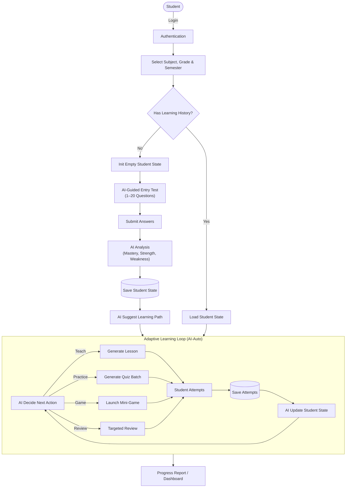

# AIDUC (E-learning App)
> **AI-Driven Adaptive Education Platform**

## 1. Problem & Solution (Why AI?)
**The Problem**: Traditional education follows a "one-size-fits-all" approach. Students with gaps in foundational knowledge (e.g., Math 8) struggle in higher grades (Math 12) without personalized remediation. Teachers cannot manually track the micro-weaknesses of 40+ students simultaneously.

**The Solution**: AIDUC acts as a **Personalized AI Tutor** that scales.
*   **Workflow Integration**: It doesn't replace teachers but augments them by handling the *diagnostic* and *remedial* loop.
*   **Beyond Accuracy**: The system prioritizes *educational utility*. Even if the AI's "explanation" isn't 100% perfect, the *curriculum routing* (directing student to the right Lesson) brings immediate value.

### Key Features & Production Readiness
*   **Semester-Based Entry Test**: Assessment tailored to specific timeframes (e.g., Grade 6 - Semester 1).
*   **AI Reliability & Fallback**:
    *   *System*: Google Gemini Pro via FastAPI.
    *   *Fallback*: If AI creates invalid JSON or times out, the system defaults to **Rule-Based Heuristics** (Standard Grade 10 logic).
    *   *Safety*: All AI-generated content is tagged for "Teacher Review" in the Admin Dashboard.
*   **Baseline & Metrics**:
    *   *Baseline*: Standard linear curriculum progression.
    *   *Success Metric*: 20% improvement in "re-test" scores after completing the Suggested Path.

---

## 2. Technical Architecture
The system is built on a robust, scalable stack designed for high performance and extensibility.

| Component | Technology | Role |
| :--- | :--- | :--- |
| **Backend API** | **Python (FastAPI)** | Async API, CORS enabled, Modular Router |
| **AI Engine** | **Gemini 1.5 Flash** | **Context Injection RAG** (No Embeddings), High Speed |
| **Frontend UI** | **React + Vite** | Modern Dark Mode Interface, Markdown Rendering |
| **Knowledge Base** | **Excel + Pandas** | Dynamic Filtering by Grade/Lesson |

### Key Features (Implemented)
1.  **Context Injection Strategy**:
    -   Instead of traditional Vector Search (which hits Quota limits), we leverage the massive Context Window of Gemini 1.5 Flash.
    -   Entire Excel Knowledge Base is injected directly into the Prompt.
    -   *Result*: Zero Quota errors, higher accuracy for small/medium datasets.

2.  **Accumulated Knowledge Logic ("Học cuốn chiếu")**:
    -   **Rule**: `Knowledge = (All Grades < Current) + (Current Grade <= Current Lesson)`.
    -   *Example*: A Grade 9 student asking about Grade 6 will get an answer. A Grade 6 student asking about Grade 9 will be blocked.

3.  **Dynamic Teacher Persona**:
    -   **Math**: Socratic method (Step-by-step guidance).
    -   **History**: Storytelling mode.
    -   **Literature**: Emotional & stylistic analysis.

### System Flow (Pipeline)


---

---

## 3. Comprehensive Execution Plan (2-Person Team)

### Phase 1: Foundation & Data Infrastructure (Week 1)
**Goal**: Establish the system backbone and prepare the Knowledge Base.

#### Member 1: System Architect (Backend Focus)
*   **Repo Setup**: Initialize Git, Folder Structure (FastAPI + React), and CI/CD pipelines.
*   **Database Design**: Create ERD for Core Tables:
    *   `Users` (differentiating Student/Admin roles).
    *   `Curriculum` (Subject -> Grade -> Semester -> Chapter -> Lesson).
*   **API Implementation**: Build Auth endpoints (`POST /login`, `POST /register`) and Curriculum Retrieval (`GET /subjects`).

#### Member 2: AI Specialist (Data Focus)
*   **Data Collection**: Gather Math Textbooks (PDF/Word) for Grades 6-12.
*   **Data Labeling**: Tag collected data by "Semester 1" vs "Semester 2".
*   **RAG Feasibility**: Write Python scripts to test Text Extraction from PDFs (using `PyPDF2` or `LlamaParse`).

### Phase 2: Core Engine & Teaching Logic (Weeks 2-3)
**Goal**: Make the system "Smart" and able to "Teach".

#### Member 1: System Architect
*   **Business Logic**: Implement the "Entry Test" flow:
    *   Check `SubjectHistory` table.
    *   If null -> Trigger "Generate Test" Event.
*   **Database**: Add `TestResults` and `LearningPath` tables.
*   **API Integration**: Connect Backend to the AI Module via internal services.

#### Member 2: AI Specialist
*   **Prompt Engineering**: Design System Prompts for:
    *   *Role*: "You are an empathetic Tutor."
    *   *Task*: "Explain concepts from the provided Context (RAG)."
*   **Assessment Logic**: precise logic to classify student errors (e.g., "Calculation Error" vs "Conceptual Error").
*   **Curriculum Mapping**: Map extracted textbook content to the Database structure.

### Phase 3: Engagement & Scaling (Weeks 4-5)
**Goal**: Frontend Polish and Gamification.

#### Member 1: System Architect
*   **Dashboard API**: Aggregate data for Teacher Heatmaps (`GET /stats/class-performance`).
*   **Real-time Socket**: Implement WebSocket for Live Chat latency reduction.

#### Member 2: AI Specialist
*   **Game Scoring**: Define algorithms for "Speed Sort" (Scoring based on accuracy + time).
*   **Adaptive Tuning**: Refine the difficulty jump algorithm (e.g., 3 correct answers -> +5% difficulty).

---

## 4. Getting Started
(Instructions for developers)

1.  **Clone Repository**: `git clone https://github.com/dungna13/E-learningApp.git`
2.  **Backend Setup**:
    ```bash
    cd aiduc_backend
    pip install -r requirements.txt
    uvicorn main:app --reload
    ```
