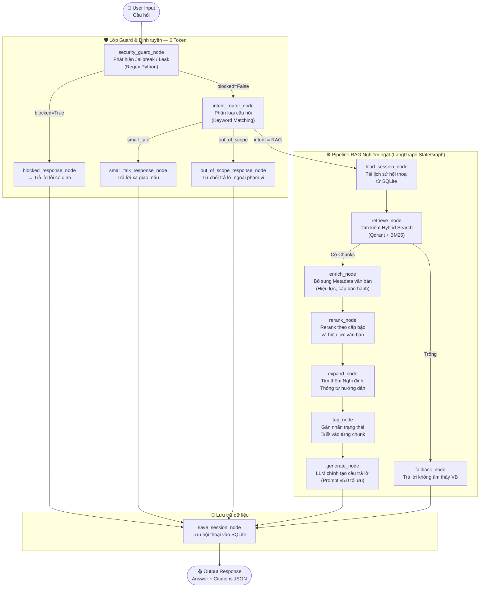

# ⚖️ GovDocFinder - Hệ thống Tìm kiếm & Hỏi đáp Văn bản Hành chính Quốc gia

[](https://fastapi.tiangolo.com)
[](https://github.com/langchain-ai/langgraph)
[](https://www.python.org)
[](https://qdrant.tech)
[](https://www.sqlite.org)

**GovDocFinder** là hệ thống thông minh hỗ trợ tìm kiếm, phân tích và hỏi đáp tự động trên nền tảng Văn bản Quy phạm Pháp luật và Văn bản Hành chính Việt Nam. Bằng việc kết hợp kiến trúc đồ thị trạng thái **LangGraph (StateGraph)**, tìm kiếm phức hợp **Hybrid Search** và lớp khiên bảo mật **0-Token Guard Layer**, GovDocFinder mang lại hiệu năng vượt trội, độ tin cậy tuyệt đối (Zero-Hallucination) và khả năng tối ưu hóa chi phí vận hành lên tới **-87%**.

---

## 🚀 Tính năng nổi bật

### 1. 🛡️ Guard & Routing Layer (Tối ưu hóa Chi phí & Bảo mật)
* **Security Guard Node (0-Token):** Kiểm tra đầu vào hoàn toàn bằng Python Regex cục bộ để phát hiện kịp thời các nỗ lực Jailbreak, Prompt Injection hoặc cố tình dò hỏi (Leak) System Prompt của hệ thống trước khi gọi tới LLM chính.
* **Intent Router Node (0-Token):** Phân loại mục đích người dùng nhanh chóng bằng bộ lọc từ khóa. Nếu người dùng nhập câu hỏi xã giao (`small_talk`) hoặc ngoài phạm vi hệ thống (`out_of_scope`), hệ thống phản hồi cố định ngay lập tức trong **< 5ms** mà không làm tiêu tốn bất kỳ Token LLM nào.

### 2. ⚙️ Bộ máy RAG Nghiêm ngặt (Strict RAG Engine)
* **Hybrid Search (BM25 + Vector Search):** Kết hợp thuật toán tìm kiếm từ khóa truyền thống (SQLite FTS5 BM25) với tìm kiếm ngữ nghĩa sâu (Qdrant Vector DB) để trả về các phân đoạn luật sát nghĩa nhất.
* **Hierarchy-Aware Boosting:** Tự động điều chỉnh trọng số điểm (Scoring) dựa trên **Cấp bậc pháp lý** (Hiến pháp > Bộ luật > Luật > Nghị định > Thông tư...) và **Trạng thái hiệu lực** (ưu tiên văn bản mới, còn hiệu lực).
* **Legal Relations Expansion:** Khi người dùng hỏi về một Luật cụ thể, hệ thống sẽ tự động truy vấn mở rộng các Nghị định, Thông tư hướng dẫn thi hành đi kèm để nạp đầy đủ ngữ cảnh cho LLM.
* **Auto Tagging Badge:** Gắn nhãn trạng thái hiệu lực trực quan (🟢 Còn hiệu lực, 🔴 Hết hiệu lực, 🟡 Hết hiệu lực một phần) trực tiếp vào từng đoạn trích dẫn để người dùng và LLM dễ dàng đối chiếu.
* **Prompt Optimization v5.0:** Rút gọn tối đa các chỉ thị phòng thủ, chỉ thị chuyển đổi văn phong dài dòng trong prompt gốc để giảm **-87% input token**, nâng cao tốc độ sinh phản hồi.

### 3. 📄 Sinh biểu mẫu hành chính tự động (Document Generator)
* Tự động trích xuất thông tin hành chính từ lịch sử hội thoại của người dùng qua cấu trúc JSON nghiêm ngặt để tự động điền (Auto-fill) vào các biểu mẫu quy chuẩn (Đơn khiếu nại, Đơn kiến nghị, Tờ trình, Công văn...).
* Hỗ trợ kết xuất tài liệu ra các định dạng phổ biến: **Markdown**, **Microsoft Word (.docx)** và **PDF** chất lượng cao.

### 4. 💾 Quản lý Phiên hội thoại & Trí nhớ dài hạn
* Tích hợp cơ sở dữ liệu SQLite lưu trữ lịch sử trò chuyện theo từng Session ID.
* Cơ chế tự động tóm tắt tịnh tiến cuộc hội thoại để duy trì ngữ cảnh dài hạn mà không làm tràn bộ nhớ cửa sổ ngữ cảnh (Context Window).

---

## 🏗️ Kiến trúc luồng xử lý (Graph Flow)

Hệ thống hoạt động trên đồ thị trạng thái LangGraph được thiết kế tuần tự và an toàn:



---

## 📂 Cấu trúc thư mục dự án

```text
GovDocFinder/
├── src/
│   ├── core/           # Core Logic: Engine RAG, Guard Layer, Embedding Service
│   │   ├── guard_nodes.py    # Lớp bảo mật & định tuyến 0-token
│   │   ├── rag_engine.py     # Cấu hình đồ thị LangGraph
│   │   └── ai_service.py     # Dịch vụ gọi LLM (LiteLLM)
│   ├── database/       # Cơ sở dữ liệu: SQLite, Qdrant setup
│   └── services/       # Module phụ trợ: Quản lý session, sinh biểu mẫu Word/PDF
│   └── config.py       # Cấu hình tập trung (Biến môi trường, Model, Trọng số)
├── prompts/            # Thư mục chứa System Prompts tối ưu hóa v5.0
├── templates/          # Giao diện Web (FastAPI Jinja2)
│   ├── index.html      # Giao diện Tìm kiếm Văn bản
│   ├── qa.html         # Giao diện Hỏi đáp AI & Sinh biểu mẫu
│   └── doc_templates/  # Các mẫu văn bản hành chính quy chuẩn
├── tests/              # Tập hợp các file Unit Test kiểm thử hệ thống
├── requirements.txt    # Danh sách thư viện phụ thuộc
├── main.py             # FastAPI Server Entry Point
└── GovDocFinder_Postman_Collection.json  # File test API dành cho Postman
```

---

## 🛠️ Công nghệ cốt lõi

* **Backend Framework:** FastAPI (Asynchronous, High Performance)
* **Graph Engine:** LangGraph (StateGraph) để quản lý luồng hội thoại
* **Vector Database:** Qdrant (Lưu trữ và tìm kiếm vector nhúng)
* **Full-Text Search:** SQLite FTS5 (Tìm kiếm từ khóa bằng thuật toán BM25)
* **LLM Middleware:** LiteLLM (Hỗ trợ Google Gemini, Anthropic Claude, OpenAI)
* **Document Processing:** `python-docx` kết hợp chuyển đổi bằng `LibreOffice` headless.

---

## 📦 Hướng dẫn cài đặt & Khởi chạy

### 1. Yêu cầu hệ thống
* Python 3.10 trở lên
* Đã cài đặt LibreOffice (để hỗ trợ sinh/convert file PDF)

### 2. Tải mã nguồn và cài đặt dependencies
```bash
git clone https://github.com/dungna13/DEMOMVP.git
cd DEMOMVP
pip install -r requirements.txt
```

### 3. Cấu hình môi trường
Tạo file `.env` tại thư mục gốc của dự án và cung cấp các API key cần thiết:
```env
# API Keys cho các LLM
GEMINI_API_KEY=your_gemini_api_key_here
ANTHROPIC_API_KEY=your_claude_api_key_here
OPENAI_API_KEY=your_openai_api_key_here
```

### 4. Khởi chạy ứng dụng
Chạy server FastAPI:
```bash
python main.py
```
Sau khi khởi chạy thành công:
* **Giao diện tìm kiếm pháp luật:** Truy cập `http://localhost:8000`
* **Giao diện tư vấn pháp lý & sinh biểu mẫu:** Truy cập `http://localhost:8000/qa`
* **Tài liệu API tự động (Swagger UI):** Truy cập `http://localhost:8000/docs`

---

## 📖 Hướng dẫn kiểm thử & API

### 1. Chạy Unit Test
Để kiểm tra tính nhất quán của cấu hình và các thuật toán rerank, chạy lệnh:
```bash
pytest tests/
```

### 2. Kiểm thử API qua Postman
Nhập (Import) file `GovDocFinder_Postman_Collection.json` vào ứng dụng Postman để trải nghiệm toàn bộ các API được thiết kế sẵn:
* API Tìm kiếm Hybrid
* API Hỏi đáp Streaming qua Server-Sent Events (SSE)
* API Tạo và tải về biểu mẫu hành chính (Word/PDF)

---

## 🛡️ Giấy phép phát triển
Dự án được bảo lưu quyền phát triển cho mục đích xây dựng giải pháp MVP (Minimum Viable Product). Mọi sao chép hoặc phân phối thương mại cần có sự đồng ý của tác giả.
