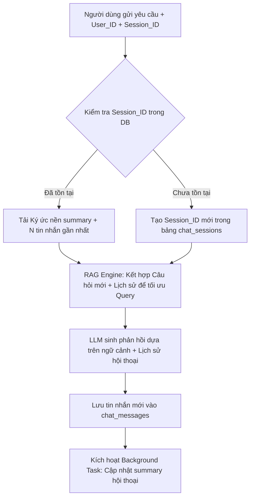
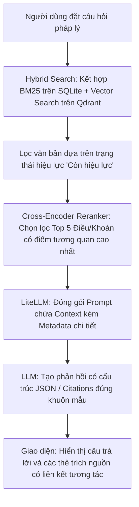
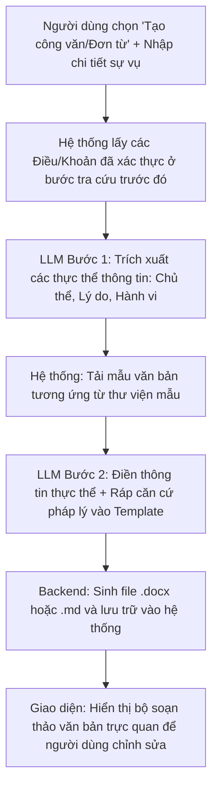
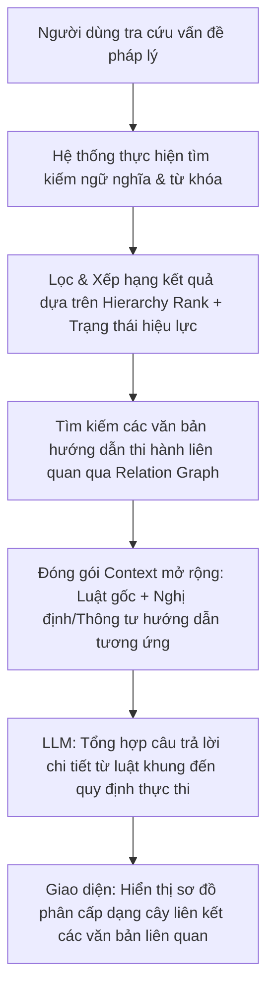

# TÀI LIỆU KHẢO SÁT & THIẾT KẾ TÍNH NĂNG HỆ THỐNG RAG PHÁP LUẬT (PROPOSAL & ARCHITECTURE SPECIFICATION)

Tài liệu này đặc tả chi tiết kiến trúc, giải pháp kỹ thuật và quy trình nghiệp vụ (workflow) cho 4 tính năng lõi của hệ thống Trợ lý Pháp lý Thông minh. Thiết kế hướng tới việc giải quyết các thách thức về ngữ cảnh dài hạn, độ chính xác tuyệt đối trong trích xuất văn bản pháp lý, tự động hóa soạn thảo văn bản hành chính, và hệ thống hóa phân cấp hiệu lực pháp luật.

---

## TÍNH NĂNG 1: Lưu Lịch Sử Trò Chuyện & Trí Nhớ Dài Hạn (Long-term Memory)

### 1. Mục tiêu & Nghiệp vụ
Khắc phục giới hạn mất ngữ cảnh giữa các phiên làm việc (sessions) của người dùng. Thay vì chỉ truyền mảng tin nhắn tạm thời (`chat_history`), hệ thống thiết lập bộ nhớ hai tầng (nhớ ngắn hạn và nhớ dài hạn) giúp chatbot hiểu được hành trình tìm kiếm và tư vấn pháp lý xuyên suốt của người dùng mà không làm quá tải ngữ cảnh (Context Window) của mô hình ngôn ngữ lớn (LLM).

### 2. Giải pháp Kỹ thuật
*   **Database Persistent Storage (SQLite - `vanban.db`):** 
    *   Bảng `chat_sessions`: Lưu thông tin phiên (`session_id`, `user_id`, `created_at`, `summary`).
    *   Bảng `chat_messages`: Lưu chi tiết hội thoại (`message_id`, `session_id`, `role` [user/assistant], `content`, `timestamp`, `tokens_used`).
*   **Conversation Buffer Window Memory (Ngữ cảnh ngắn hạn):** 
    *   Chỉ trích xuất $N$ tin nhắn gần nhất (ví dụ: 5-6 cặp QA mới nhất) từ `chat_messages` để làm ngữ cảnh trực tiếp cho LLM khi gọi API LiteLLM. Cách này tối ưu hóa chi phí token và duy trì tính thời sự của cuộc hội thoại.
*   **LLM-Generated Summary Memory (Trí nhớ dài hạn/Ký ức nền):**
    *   Sử dụng một cơ chế Background Worker kích hoạt khi số lượng tin nhắn trong phiên vượt quá ngưỡng $K$ (ví dụ: > 10 tin nhắn).
    *   LLM phụ nhiệm (hoặc chạy không đồng bộ) sẽ tóm tắt lại các điểm chính của phiên (ví dụ: *"Người dùng đang tìm hiểu điều kiện chuyển nhượng quyền sử dụng đất nông nghiệp tại Long An và đang vướng mắc về hạn mức nhận chuyển quyền"*).
    *   Nội dung tóm tắt này được lưu vào `chat_sessions.summary` và được chèn vào `System Prompt` dưới dạng ký ức nền (Profile Context) trong các lần tương tác tiếp theo.

### 3. Quy trình Xử lý (Workflow)



---

## TÍNH NĂNG 2: Trích Xuất Chính Xác Điều, Khoản, Công Văn (Strict RAG)

### 1. Mục tiêu & Nghiệp vụ
Đảm bảo câu trả lời của Trợ lý Pháp lý đạt độ chính xác tuyệt đối, triệt tiêu hiện tượng ảo tưởng (Hallucination). Mọi thông tin tư vấn phải chỉ rõ căn cứ pháp lý theo cấu trúc phân cấp chuẩn của Việt Nam (**Điều -> Khoản -> Điểm**) và chỉ ra chính xác số hiệu văn bản (Luật, Nghị định, Thông tư). Nếu thông tin không nằm trong cơ sở dữ liệu (KB), hệ thống phải từ chối trả lời thay vì tự suy diễn.

### 2. Giải pháp Kỹ thuật
*   **Parent-Child Chunking & Metadata Mapping:** 
    *   Khi nạp dữ liệu (Ingestion Pipeline), văn bản pháp luật không được cắt theo số ký tự thuần túy mà được phân tách theo cấu trúc logic: **Document -> Section (Điều) -> Chunk (Khoản/Điểm)**.
    *   Mỗi chunk lưu trong cơ sở dữ liệu vector (Qdrant) hoặc relational (SQLite) bắt buộc phải mang metadata đầy đủ: `document_id`, `document_number`, `article_title` (Tên Điều), `clause_id` (Khoản), `effectiveness_status` (Hiệu lực).
*   **System Prompt Constraint (Kỷ luật Prompt nghiêm ngặt):**
    *   Thiết lập ranh giới hệ thống rõ ràng: *"Bạn là chuyên gia tư vấn pháp lý chuyên nghiệp. Bạn CHỈ được phép sử dụng thông tin trong phần 'Context' được cung cấp để trả lời câu hỏi. Nếu Context không chứa thông tin phù hợp, hãy trả lời: 'Tôi không tìm thấy căn cứ pháp lý phù hợp trong hệ thống dữ liệu hiện tại để trả lời câu hỏi này.' Tuyệt đối không sử dụng tri thức có sẵn ngoài Context."*
*   **Structured Outputs / Schema Enforcement (LiteLLM JSON Mode):**
    *   Sử dụng định dạng đầu ra có cấu trúc (Pydantic Schema) để ép LLM trả về JSON dạng:
        ```json
        {
          "answer": "Nội dung câu trả lời tóm tắt pháp lý...",
          "citations": [
            {
              "document_name": "Luật Đất đai 2024",
              "document_number": "31/2024/QH15",
              "article": "Điều 45",
              "clause": "Khoản 1",
              "point": "Điểm a",
              "extracted_text": "Trích dẫn nguyên văn văn bản..."
            }
          ]
        }
        ```

### 3. Quy trình Xử lý (Workflow)



---

## TÍNH NĂNG 3: Tự Động Soạn Thảo Văn Bản Hành Chính (Document Generator)

### 1. Mục tiêu & Nghiệp vụ
Hỗ trợ người dùng chuyển đổi từ thông tin tư vấn pháp lý sang văn bản hành chính thực tế (ví dụ: Đơn khiếu nại, Tờ trình, Công văn trả lời, Hợp đồng mẫu) một cách nhanh chóng, đúng quy chuẩn trình bày văn bản hành chính của Nhà nước Việt Nam (Nghị định 30/2020/NĐ-CP).

### 2. Giải pháp Kỹ thuật
*   **Template-Based Generation (Hệ thống Văn bản Mẫu):**
    *   Xây dựng thư mục mẫu `/templates` chứa các bộ khung văn bản chuẩn dưới định dạng Markdown hoặc Jinja2 XML/HTML. Các khung này định nghĩa sẵn vị trí của: Tiêu ngữ, Quốc hiệu, Địa danh - Ngày tháng, Kính gửi, Căn cứ pháp lý (nơi chèn các Điều/Khoản), Nội dung sự việc, Nơi nhận.
*   **Few-Shot Prompting & Văn phong Hành chính:**
    *   Cung cấp các mẫu văn bản mẫu hoàn chỉnh (One-Shot/Few-Shot) trong prompt của LLM để hướng dẫn mô hình sử dụng thuật ngữ pháp lý chuẩn xác, cách xưng hô nghiêm túc và logic lập luận chặt chẽ.
*   **Two-Step LLM Pipeline (Quy trình Sinh hai bước):**
    *   *Bước 1 (Information Extraction):* Phân tích yêu cầu cụ thể của người dùng và các Điều/Khoản pháp lý đã được chọn ở Tính năng 2 để trích xuất các biến dữ liệu cần thiết (Ví dụ: Tên người gửi, Địa chỉ, Lý do khiếu nại, Điều khoản vi phạm).
    *   *Bước 2 (Template Rendering & Drafting):* LLM tổng hợp các biến đã trích xuất, tự động điền vào khung Template, đồng thời viết phần nội dung chi tiết theo đúng cấu trúc hành chính.
*   **Định dạng xuất bản (Output formats):**
    *   Biên dịch nội dung Markdown đã tạo sang file `.docx` (sử dụng thư viện như `python-docx`) hoặc lưu trữ trực tiếp vào thư mục Wiki/Obsidian dưới dạng `.md`.

### 3. Quy trình Xử lý (Workflow)



---

## TÍNH NĂNG 4: Phân Cấp & Hệ Thống Hóa Văn Bản Pháp Luật (Legal Hierarchy & Cross-Reference Mapping)

### 1. Mục tiêu & Nghiệp vụ
Trong hệ thống pháp luật Việt Nam, các văn bản được ban hành theo một trật tự hiệu lực pháp lý nghiêm ngặt (Hiến pháp -> Luật -> Nghị định -> Thông tư -> Văn bản địa phương). Đồng thời giữa chúng luôn tồn tại mối quan hệ mật thiết (ví dụ: Nghị định hướng dẫn Luật, Thông tư hướng dẫn Nghị định, văn bản sửa đổi/bổ sung, hoặc văn bản thay thế).
Tính năng này giúp:
1.  **Phân loại và gán nhãn mức độ hiệu lực pháp lý** để ưu tiên áp dụng văn bản cấp cao hơn hoặc văn bản chuyên ngành/văn bản mới nhất khi có xung đột pháp lý.
2.  **Thiết lập bản đồ liên kết tài liệu (Relationship Graph)** để khi người dùng tra cứu một Điều Luật, hệ thống sẽ tự động đề xuất các Khoản tương ứng ở Nghị định hướng dẫn hoặc Thông tư hướng dẫn thi hành.

### 2. Giải pháp Kỹ thuật
*   **Thiết kế Trật tự Hiệu lực (Hierarchy Ranking):**
    *   Định nghĩa bảng phân cấp loại văn bản với thang điểm ưu tiên (Rank Score) từ 15 (cao nhất) đến 1 (thấp nhất) theo Luật Ban hành văn bản quy phạm pháp luật Việt Nam:
        1. **Hiến pháp** (Rank 15)
        2. **Bộ luật, luật, nghị quyết của Quốc hội** (Rank 14)
        3. **Pháp lệnh, nghị quyết của Ủy ban thường vụ Quốc hội**; nghị quyết liên tịch giữa Ủy ban thường vụ Quốc hội với Đoàn Chủ tịch Ủy ban trung ương Mặt trận Tổ quốc Việt Nam (Rank 13)
        4. **Lệnh, quyết định của Chủ tịch nước** (Rank 12)
        5. **Nghị định của Chính phủ**; nghị quyết liên tịch giữa Chính phủ với Đoàn Chủ tịch Ủy ban trung ương Mặt trận Tổ quốc Việt Nam (Rank 11)
        6. **Quyết định của Thủ tướng Chính phủ** (Rank 10)
        7. **Nghị quyết của Hội đồng Thẩm phán Tòa án nhân dân tối cao** (Rank 9)
        8. **Thông tư** của Chánh án Tòa án nhân dân tối cao; Viện trưởng Viện kiểm sát nhân dân tối cao; Bộ trưởng, Thủ trưởng cơ quan ngang bộ; Thông tư liên tịch; Quyết định của Tổng Kiểm toán nhà nước (Rank 8)
        9. **Nghị quyết của Hội đồng nhân dân cấp tỉnh** (Rank 7)
        10. **Quyết định của Ủy ban nhân dân cấp tỉnh** (Rank 6)
        11. **Văn bản quy phạm pháp luật của chính quyền địa phương** ở đơn vị hành chính – kinh tế đặc biệt (Rank 5)
        12. **Nghị quyết của Hội đồng nhân dân cấp huyện** (Rank 4)
        13. **Quyết định của Ủy ban nhân dân cấp huyện** (Rank 3)
        14. **Nghị quyết của Hội đồng nhân dân cấp xã** (Rank 2)
        15. **Quyết định của Ủy ban nhân dân cấp xã** (Rank 1)
*   **Mô hình Quan hệ Văn bản (Relational Graph Schema):**
    *   Tạo bảng quan hệ `document_relations` để ánh xạ mối liên kết giữa các thực thể pháp luật:
        *   `source_doc_id` (Văn bản gốc - ví dụ: Luật Đất đai)
        *   `target_doc_id` (Văn bản liên quan - ví dụ: Nghị định 102/2024/NĐ-CP)
        *   `relation_type` (Loại quan hệ):
            *   `CAN_CU`: Văn bản nguồn dùng làm căn cứ ban hành.
            *   `HUONG_DAN`: Văn bản chi tiết hóa, hướng dẫn thi hành (Nghị định hướng dẫn Luật).
            *   `SUA_DOI_BO_SUNG`: Văn bản điều chỉnh một số điều khoản của văn bản cũ.
            *   `THAY_THE`: Văn bản bãi bỏ và thay thế hoàn toàn văn bản cũ.
*   **Hierarchy-Aware Search & RAG Routing (Định tuyến RAG theo cấp bậc):**
    *   *Search Boosting:* Khi tính điểm tìm kiếm Hybrid Search, nhân thêm hệ số trọng số hiệu lực (Rank Score) và hệ số thời gian (ngày ban hành gần nhất).
    *   *Context Expansion:* Khi người dùng truy vấn một Điều trong Luật, hệ thống tự động tìm trong bảng `document_relations` các Điều/Khoản thuộc Nghị định/Thông tư hướng dẫn liên kết (`relation_type = 'HUONG_DAN'`) để đưa vào Context của LLM, giúp câu trả lời đầy đủ cả khung luật chung và hướng dẫn thi hành chi tiết.

### 3. Quy trình Xử lý (Workflow)



---

## 🗺️ KIẾN TRÚC MỞ RỘNG CƠ SỞ DỮ LIỆU (DATABASE SCHEMA EXTENSION)

Dưới đây là thiết kế chi tiết cho các bảng cơ sở dữ liệu mới cần được bổ sung vào `src/database/models.py` để hiện thực hóa 4 tính năng trên:

```sql
-- 1. BẢNG QUẢN LÝ PHIÊN TRÒ CHUYỆN (SESSION)
CREATE TABLE chat_sessions (
    session_id TEXT PRIMARY KEY,
    user_id TEXT NOT NULL,
    created_at TIMESTAMP DEFAULT CURRENT_TIMESTAMP,
    updated_at TIMESTAMP DEFAULT CURRENT_TIMESTAMP,
    summary TEXT -- Lưu trí nhớ dài hạn (tóm tắt bối cảnh)
);

-- 2. BẢNG LƯU LỊCH SỬ TIN NHẮN (CHAT HISTORY)
CREATE TABLE chat_messages (
    message_id TEXT PRIMARY KEY,
    session_id TEXT NOT NULL,
    role TEXT CHECK(role IN ('user', 'assistant', 'system')),
    content TEXT NOT NULL,
    timestamp TIMESTAMP DEFAULT CURRENT_TIMESTAMP,
    tokens_used INTEGER,
    FOREIGN KEY (session_id) REFERENCES chat_sessions(session_id) ON DELETE CASCADE
);

-- 3. BẢNG PHÂN CẤP LOẠI VÂN BẢN PHÁP LUẬT (LEGAL HIERARCHY)
CREATE TABLE document_types (
    type_code TEXT PRIMARY KEY, -- vd: 'LUAT', 'NGHI_DINH', 'THONG_TU'
    type_name TEXT NOT NULL,     -- vd: 'Luật', 'Nghị định', 'Thông tư'
    hierarchy_rank INTEGER NOT NULL -- Điểm xếp hạng hiệu lực (10 là cao nhất)
);

-- 4. BẢNG QUAN HỆ GIỮA CÁC VĂN BẢN (DOCUMENT RELATIONSHIP GRAPH)
CREATE TABLE document_relations (
    relation_id INTEGER PRIMARY KEY AUTOINCREMENT,
    source_doc_id TEXT NOT NULL, -- Văn bản gốc
    target_doc_id TEXT NOT NULL, -- Văn bản liên kết
    relation_type TEXT CHECK(relation_type IN ('CAN_CU', 'HUONG_DAN', 'SUA_DOI_BO_SUNG', 'THAY_THE')),
    description TEXT, -- Mô tả chi tiết mối liên kết (nếu có)
    FOREIGN KEY (source_doc_id) REFERENCES documents(id) ON DELETE CASCADE,
    FOREIGN KEY (target_doc_id) REFERENCES documents(id) ON DELETE CASCADE
);
```

Tài liệu này đóng vai trò làm khung xương kỹ thuật để nhóm phát triển triển khai xây dựng các module dịch vụ trong thư mục `src/services/` và tích hợp vào hệ thống RAG hiện hữu.
