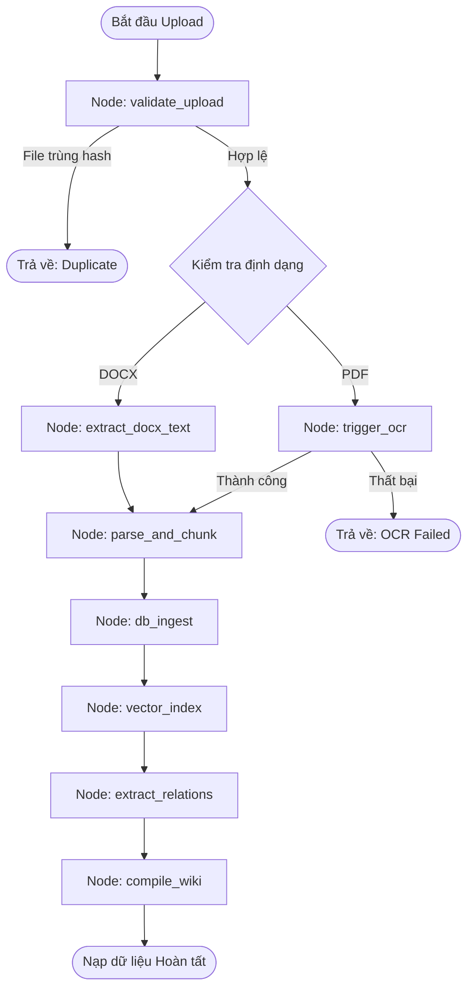

# ⚖️ Tài liệu Kiến trúc & Hiện thực Hệ thống (DEMOMVP)

Tài liệu này mô tả chi tiết kiến trúc, các công nghệ sử dụng, cấu trúc cơ sở dữ liệu và cách hiện thực các chức năng chính trong dự án **Hệ thống Tìm kiếm Văn bản Hành chính Quốc gia (DEMOMVP)** qua các Phase phát triển.

---

## 1. Tổng quan Dự án

Hệ thống DEMOMVP được thiết kế là một cổng tra cứu, hỏi đáp pháp luật thông minh và biên soạn Knowledge Wiki dựa trên dữ liệu văn bản hành chính Việt Nam. Hệ thống kết hợp các công nghệ tìm kiếm tiên tiến cùng phương pháp **RAG (Retrieval-Augmented Generation)** để đảm bảo câu trả lời chính xác, tránh hiện tượng ảo tưởng (hallucination) của mô hình ngôn ngữ lớn (LLM).

### Công nghệ cốt lõi
*   **Ngôn ngữ**: Python 3.11+
*   **Backend Framework**: FastAPI (Uvicorn làm máy chủ chạy chính)
*   **Database**: SQLite (sử dụng WAL mode cho phép tối ưu hóa ghi/đọc, kết hợp FTS5 cho tìm kiếm toàn văn)
*   **Vector Database**: Qdrant (Hỗ trợ lưu trữ cục bộ `local` hoặc kết nối `server`)
*   **Mô hình nhúng (Embedding)**: `bkai-foundation-models/vietnamese-bi-encoder` (768 chiều)
*   **LLM Orchestration**: LangChain, LangGraph (dùng cho luồng RAG phức tạp)
*   **LLM Providers**: Tích hợp đa dạng qua LangChain Provider Packages (`langchain_google_genai`, `langchain_openai`, `langchain_anthropic`, `langchain_ollama`) — hỗ trợ Google Gemini, OpenAI, Anthropic Claude và Ollama local.
*   **Xử lý Tài liệu**: `python-docx` và `soffice` (LibreOffice) để chuyển đổi Markdown -> DOCX -> PDF.
*   **Giao diện**: HTML5, Vanilla JS, CSS (Thiết kế kính mờ - Glassmorphism).

---

## 2. Cấu trúc Thư mục Dự án

```text
DEMOMVP/
├── src/
│   ├── core/
│   │   ├── ai_service.py          # LangChain LLM Factory, tóm tắt, gắn tag tự động
│   │   ├── embedding_service.py   # Xử lý sinh nhúng và đẩy lên Qdrant Vector DB
│   │   ├── ingestion_graph.py     # [Phase 5] LangGraph StateGraph cho Upload & OCR Pipeline
│   │   ├── output_schemas.py      # Định nghĩa cấu trúc Pydantic cho dữ liệu đầu ra của LLM
│   │   ├── rag_engine.py          # Luồng RAG StateGraph sử dụng LangGraph
│   │   └── vector_search.py       # Tìm kiếm Vector, Hybrid Search & RRF Re-ranking
│   ├── database/
│   │   ├── database.py            # Kết nối SQLite, định nghĩa Schema và các Triggers FTS5
│   │   └── models.py              # Khai báo các nhãn trạng thái hiệu lực, quan hệ pháp lý
│   ├── services/
│   │   ├── chat_service.py        # Quản lý phiên trò chuyện (Sessions) & lịch sử tin nhắn
│   │   ├── doc_generator.py       # Tạo dự thảo văn bản từ QA (Markdown -> DOCX -> PDF)
│   │   ├── ingestion.py           # Đọc tệp JSON từ folder chunks, chuẩn hóa tiêu đề và nạp vào DB
│   │   ├── legal_relations.py     # Phát hiện quan hệ pháp lý giữa các văn bản (bằng Regex/LLM)
│   │   ├── ocr_connector.py       # [Phase 5] Interface kết nối dịch vụ OCR bên ngoài
│   │   ├── search.py              # Tìm kiếm BM25 và tổng hợp bộ lọc (Facets)
│   │   └── wiki_compiler.py       # Biên soạn và linting wiki (Karpathy LLM Wiki Pattern)
│   └── config.py                  # Cấu hình tập trung (API keys, trọng số tìm kiếm, tham số RAG)
├── templates/                     # Giao diện Server-side Rendering (Jinja2)
│   ├── index.html                 # Trang chủ tìm kiếm và lọc văn bản
│   ├── qa.html                    # Trang giao diện Hỏi đáp AI và xuất văn bản hành chính
│   ├── document.html              # Trang hiển thị chi tiết văn bản & mối quan hệ
│   ├── wiki.html                  # Trang tổng quan Knowledge Wiki
│   ├── wiki_page.html             # Trang chi tiết một Wiki Page
│   └── doc_templates/             # Các biểu mẫu văn bản hành chính (Markdown)
├── prompts/                       # Thư mục chứa Mega Prompts cấu trúc JSON
├── chunks/                        # **Nguồn dữ liệu chính** — các file JSON văn bản pháp luật đã chunk
│   └── uploads/                   # [Phase 5] Kết quả OCR dạng JSON từ file do người dùng upload
├── data/                          # Mẫu JSON tham chiếu cho định dạng đầu ra OCR (đang chờ đội OCR hoàn thiện)
├── drafts/                        # Thư mục chứa các tệp văn bản sinh ra (MD, DOCX, PDF)
├── wiki_vault/                    # Obsidian Vault chứa các file wiki Markdown kết nối backlinks
├── wiki_data/                     # Dữ liệu wiki lưu trữ định dạng JSON để backup
├── main.py                        # FastAPI App (Entry Point) định nghĩa toàn bộ API và Routes
├── phase3_cli.py                  # CLI biên dịch, kiểm tra lỗi linting và xem trạng thái wiki
└── requirements.txt               # Danh sách thư viện phụ thuộc
```

---

## 3. Chi tiết Kiến trúc & Hiện thực các Phase

### Phase 1: Ingestion & Keyword Search (BM25)
*   **Ingestion (`src/services/ingestion.py`)**: 
    *   Quét toàn bộ tệp `.json` trong thư mục `chunks/` hoặc `data/`.
    *   **Chuẩn hóa & Deduplication**: Sử dụng thuật toán băm `MD5` để loại bỏ các phân đoạn (chunk) trùng lặp nội dung.
    *   **Trích xuất tiêu đề tự động**: Sử dụng regex nhận diện loại văn bản từ số hiệu (Luật, Nghị định, Thông tư...) và bóc tách tiêu đề thực tế từ văn bản thô dựa trên các dấu hiệu cấu trúc (ví dụ: dòng bắt đầu bằng "QUYẾT ĐỊNH", cụm từ "Về việc...", "V/v...").
    *   **Phân cấp cấu trúc**: Lưu trữ chi tiết các phần, chương, mục và điều khoản vào bảng `doc_sections` và `chunks`.
*   **Keyword Search (`src/services/search.py`)**: 
    *   Tận dụng bảng ảo `documents_fts` và `chunks_fts` sử dụng engine **SQLite FTS5** với bộ mã hóa `unicode61`.
    *   Sử dụng hàm `bm25()` tích hợp sẵn trong SQLite để tính toán điểm số phù hợp của từ khóa.
    *   Hỗ trợ tính toán bộ lọc động (Facets) gom nhóm theo Lĩnh vực (Legal Fields), Cơ quan ban hành (Authority), Năm ban hành (Year), và Trạng thái hiệu lực (Status).

### Phase 2: Hybrid Search & Strict RAG Q&A
*   **Vector Search & Embedding (`src/core/embedding_service.py`)**:
    *   Sử dụng mô hình `bkai-foundation-models/vietnamese-bi-encoder` chạy trực tiếp trên thiết bị (CPU/GPU) thông qua `sentence-transformers` để sinh vectơ nhúng cho mỗi đoạn văn bản.
    *   Kết nối với cơ sở dữ liệu vector **Qdrant** (lưu trữ cục bộ dưới dạng file thông qua đường dẫn `qdrant_data/`).
*   **Hybrid Search (`src/core/vector_search.py`)**:
    *   Thực hiện tìm kiếm song song: Tìm kiếm từ khóa bằng SQLite FTS5 và tìm kiếm ngữ nghĩa (Cosine Similarity) bằng Qdrant.
    *   **Reciprocal Rank Fusion (RRF)**: Kết hợp kết quả từ hai công cụ tìm kiếm theo công thức RRF với tham số điều chỉnh hằng số $k = 60$. Hệ thống hỗ trợ 3 chế độ trọng số cấu hình sẵn:
        *   `keyword`: Tập trung 80% trọng số vào BM25.
        *   `semantic`: Tập trung 60% trọng số vào Vector Search.
        *   `balanced`: Cân bằng 50% BM25 - 50% Vector Search.
    *   **Hierarchy-Aware Boosting**: Nhân điểm số xếp hạng dựa trên cấp bậc pháp lý (Hiến pháp > Luật > Nghị định...) và áp dụng trọng số tăng cường (Boosting) đối với văn bản đang còn hiệu lực (`con_hieu_luc` nhân 2.0x, `het_hieu_luc` chỉ giữ lại hệ số phạt 0.3x).
*   **Strict RAG Engine (`src/core/rag_engine.py`)**:
    *   Hiện thực hóa một đồ thị trạng thái phức tạp bằng **LangGraph StateGraph** bao gồm các bước:
        1.  `load_session`: Nạp lịch sử chat và bối cảnh hội thoại đã tóm tắt.
        2.  `retrieve`: Lấy ra các đoạn văn bản thô dựa trên câu hỏi bằng Hybrid Search.
        3.  `enrich`: Bổ sung thông tin văn bản nguồn (số hiệu, hiệu lực, cơ quan ban hành).
        4.  `rerank`: Sắp xếp lại dựa trên mức độ liên quan, loại văn bản và tính hiệu lực pháp lý.
        5.  `expand`: Phát hiện văn bản liên quan có quan hệ "Hướng dẫn thi hành" (`huong_dan`) để nạp thêm vào ngữ cảnh RAG.
        6.  `generate`: Gọi LLM sinh câu trả lời với định dạng Pydantic chặt chẽ, loại bỏ khối suy nghĩ `<thought>`, trích xuất danh sách trích dẫn (`citations`) chi tiết đến tận số Điều, Khoản.
        7.  `fallback`: Trả về thông báo từ chối đoán mò hoặc yêu cầu làm rõ nếu không tìm thấy dữ liệu liên quan.
        8.  `save_session`: Ghi nhận tin nhắn vào cơ sở dữ liệu.

### Phase 3: Knowledge Wiki (Obsidian & Karpathy Wiki Pattern)
*   **Obsidian Vault (`src/services/wiki_compiler.py` & `phase3_cli.py`)**:
    *   Biên dịch từng tài liệu trong DB thành một trang Wiki Markdown chuẩn hóa lưu tại `wiki_vault/tom-tat/`.
    *   Tự động sinh YAML frontmatter chứa toàn bộ siêu dữ liệu (Metadata) như: `title`, `doc_number`, `issuing_authority`, `effective_date`, `created_by_model`, và trạng thái kiểm duyệt `reviewed`.
    *   Tạo liên kết ngược hai chiều (`[[backlinks]]`) tự động dẫn sang các tệp lĩnh vực (ví dụ: `[[linh-vuc/dat-dai]]`).
*   **Rule-based Fallback**:
    *   Khi có cấu hình API Key, hệ thống sử dụng LLM để tóm tắt văn bản, rút ra 3-5 điểm mấu chốt (`key_points`) và tự động sinh 3 cặp hỏi-đáp pháp lý (`suggested_qa`).
    *   Khi LLM không hoạt động, hệ thống sử dụng Regex để tự động trích xuất các thực thể hành chính (Người ký, Cơ quan liên quan, Ngày ban hành) và tạo tóm tắt sơ bộ dựa trên các điều khoản ban đầu để tránh gián đoạn dịch vụ.
*   **Wiki Linting**:
    *   Quét toàn bộ trang Wiki để phát hiện các lỗi tính nhất quán dữ liệu:
        *   `broken_link`: Đường dẫn liên kết ngược tới một trang không tồn tại.
        *   `expired_doc`: Trang wiki đang dẫn chiếu tới một văn bản hành chính đã hết hiệu lực.
        *   `orphan_page`: Trang mồ côi không có bất kỳ liên kết nào trỏ đến từ các trang khác.
    *   Cập nhật tình trạng lỗi lint (`ok`, `warn`, `error`) trực tiếp vào DB để hiển thị trên giao diện kiểm duyệt.

### Phase 4: Chat History & Long-Term Memory
*   **Session Management (`src/services/chat_service.py`)**:
    *   Quản lý các phiên hội thoại của người dùng, phân tách theo từng định danh `session_id`.
    *   Lịch sử trò chuyện được lưu trữ trực tiếp vào SQLite và được nạp làm ngữ cảnh cho mô hình LLM.
    *   **Long-Term Memory Summary**: Khi một phiên hội thoại phát sinh thêm tin nhắn mới, một tác vụ chạy ngầm (FastAPI BackgroundTasks) sẽ được kích hoạt để gọi LLM tóm tắt lại toàn bộ nội dung trò chuyện trước đó, lưu vào trường `summary` của bảng `chat_sessions`. Bối cảnh tóm tắt này sau đó được truyền trực tiếp vào System Prompt của RAG để duy trì ngữ cảnh dài hạn mà không làm tràn giới hạn token của cửa sổ ngữ cảnh LLM.

### Dịch vụ bổ sung: Tạo Văn bản Hành chính (Document Generator)
*   **Doc Gen (`src/services/doc_generator.py`)**:
    *   Hệ thống cho phép người dùng sinh tự động các văn bản hành chính (như Đơn khiếu nại, Tờ trình, Công văn) ngay sau khi nhận câu trả lời tư vấn pháp lý từ RAG.
    *   LLM đóng vai trò phân tích thông tin lịch sử hội thoại, trích xuất dữ liệu của người gửi, người nhận, lý do khiếu nại hoặc nội dung công văn dưới dạng JSON.
    *   Dữ liệu này được điền trực tiếp vào các mẫu văn bản định dạng Markdown cấu trúc sẵn (`templates/doc_templates/`).
    *   **Chuyển đổi đa định dạng**: Hệ thống gọi thư viện `python-docx` để tạo file Word `.docx` và sau đó sử dụng LibreOffice thông qua câu lệnh CLI `soffice` chạy ngầm để chuyển đổi tài liệu Word sang tệp PDF chất lượng cao, lưu tại thư mục `drafts/` phục vụ tải xuống.

---

## 4. Cấu trúc Cơ sở dữ liệu (Database Schema)

Dưới đây là sơ đồ các bảng dữ liệu chính được khởi tạo tại `vanban.db`:

```mermaid
erDiagram
    documents {
        int id PK
        text doc_number
        text title
        text doc_type
        text issuing_date
        text effective_date
        text expiry_date
        text effectiveness_status
        text signer
        text file_hash
        text content_markdown
        text summary
        text source_url
        text issuing_authority
        int relations_extracted
        int embedding_indexed
        int wiki_compiled
    }
    doc_sections {
        int id PK
        int document_id FK
        int parent_id FK
        text section_type
        text number
        text title
        text content
    }
    chunks {
        int id PK
        int document_id FK
        int section_id FK
        text content
        int chunk_index
        int token_count
        text embedding_id
        int dieu
        int khoan
        int chuong
    }
    doc_relations {
        int id PK
        int source_doc_id FK
        int target_doc_id FK
        text target_doc_number
        text relation_type
        text detected_by
        real confidence
    }
    doc_legal_fields {
        int id PK
        int document_id FK
        text field_name
        real confidence
        text source
        text model
    }
    wiki_pages {
        int id PK
        text slug UNIQUE
        text title
        text page_type
        int document_id FK
        text summary
        text key_points
        text suggested_qa
        text entities
        text markdown_path
        text markdown_content
        text model_used
        real ai_confidence
        text lint_status
        int reviewed
    }
    document_types {
        text type_code PK
        text type_name
        int hierarchy_rank
    }
    document_relations {
        int relation_id PK
        text source_doc_id
        text target_doc_id
        text relation_type
        text description
    }
    chat_sessions {
        text session_id PK
        text user_id
        text summary
    }
    chat_messages {
        text message_id PK
        text session_id FK
        text role
        text content
        text timestamp
        int tokens_used
    }

    documents ||--o{ doc_sections : "has"
    documents ||--o{ chunks : "split_into"
    doc_sections ||--o{ chunks : "contains"
    documents ||--o{ doc_relations : "source"
    documents ||--o{ doc_legal_fields : "belongs_to"
    documents ||--o| wiki_pages : "compiles_to"
    documents }o--|| document_types : "classified_by"
    chat_sessions ||--o{ chat_messages : "contains"
```

---

## 5. Hướng dẫn Khởi chạy Hệ thống

### Bước 1: Chuẩn bị Môi trường
Cài đặt các thư viện cần thiết trong file [requirements.txt](file:///c:/Projects/DEMOMVP/requirements.txt):
```bash
pip install -r requirements.txt
```
*Lưu ý: Để xuất tệp PDF từ DOCX, máy chủ cần cài đặt LibreOffice và đảm bảo đường dẫn thực thi của lệnh `soffice` nằm trong biến môi trường PATH.*

### Bước 2: Cấu hình biến môi trường
Tạo tệp `.env` tại thư mục gốc của dự án với các thông số cấu hình API keys:
```env
GEMINI_API_KEY=your_gemini_api_key_here
# Hoặc cấu hình các nhà cung cấp khác
OPENAI_API_KEY=your_openai_api_key_here
ANTHROPIC_API_KEY=your_anthropic_api_key_here
```

### Bước 3: Khởi chạy Máy chủ Backend
Chạy ứng dụng FastAPI thông qua tệp [main.py](file:///c:/Projects/DEMOMVP/main.py):
```bash
python main.py
```
*   **Trang chủ tìm kiếm (Hybrid Search)**: `http://localhost:8000`
*   **Trang Hỏi đáp Strict RAG & Sinh văn bản**: `http://localhost:8000/qa`
*   **Trang quản trị Knowledge Wiki**: `http://localhost:8000/wiki`
*   **Tài liệu hướng dẫn API**: `http://localhost:8000/docs`

### Bước 4: Vận hành CLI dành cho Wiki (Phase 3)
Sử dụng công cụ dòng lệnh [phase3_cli.py](file:///c:/Projects/DEMOMVP/phase3_cli.py) để quản trị Wiki:
*   **Biên dịch toàn bộ tài liệu sang Wiki**:
    ```bash
    python phase3_cli.py compile --all
    ```
*   **Kiểm tra lỗi liên kết / lỗi nhất quán**:
    ```bash
    python phase3_cli.py lint
    ```
*   **Xem thống kê tổng quan của Wiki**:
    ```bash
    python phase3_cli.py status
    ```

---

## 6. Thiết kế Phase 5: Upload Tài liệu & Pipeline OCR/Ingestion sử dụng LangGraph

Quy trình tải lên tệp PDF/DOCX, chuyển đổi văn bản qua OCR và nạp dữ liệu vào SQLite/Qdrant/Obsidian được điều phối tự động thông qua một đồ thị trạng thái **LangGraph StateGraph** độc lập.

> **Lưu ý**: Dịch vụ OCR đang được đội ngũ khác phát triển riêng. Hệ thống này chỉ thiết kế cổng kết nối (Connector) để nhận kết quả OCR và đưa vào pipeline ingestion hiện có. File gốc PDF/DOCX **không được lưu trữ** — chỉ giữ tạm trong bộ nhớ trong lúc xử lý, sau khi OCR xong sẽ bị xóa ngay để tránh chiếm dung lượng lưu trữ.

### 6.1. Định nghĩa State (IngestionState)

```python
from typing import TypedDict, List, Dict, Optional

class IngestionState(TypedDict, total=False):
    # ── Input ──
    file_bytes: bytes              # Nội dung file tạm (không lưu xuống ổ cứng)
    file_name: str                 # Tên file gốc (vd: "nghi_dinh_45.pdf")
    file_type: str                 # "pdf" | "docx"
    file_hash: str                 # SHA-256 để kiểm tra trùng lặp

    # ── OCR Output ──
    ocr_text: str                  # Văn bản thô sau khi OCR xử lý
    ocr_success: bool              # Cờ đánh dấu OCR thành công hay thất bại

    # ── Parse Output ──
    doc_metadata: Dict             # {doc_number, title, doc_type, issuing_date, issuing_authority}
    chunks: List[Dict]             # Danh sách chunks đã chia [{text, dieu, khoan, chuong, index}]

    # ── Pipeline Result ──
    document_id: Optional[int]     # ID trong bảng documents sau khi insert
    vector_count: int              # Số chunks đã index vào Qdrant
    relations_count: int           # Số quan hệ pháp lý phát hiện được
    wiki_slug: Optional[str]       # Slug trang wiki đã tạo

    # ── Tracking ──
    status: str                    # pending | validating | ocr_running | parsing | ingesting |
                                   # indexing | extracting | compiling | done | failed | duplicate
    current_node: str              # Tên node đang xử lý
    error_message: Optional[str]   # Chi tiết lỗi nếu status=failed
```

### 6.2. Sơ đồ Luồng Hoạt động (StateGraph Ingestion)



### 6.3. Chi tiết các Node xử lý dữ liệu

| Node | Nhiệm vụ | Input từ State | Output ghi vào State |
|------|----------|----------------|---------------------|
| `validate_upload` | Kiểm tra định dạng (.pdf/.docx), tính `SHA-256`, tra cứu `file_hash` trong bảng `documents` để phát hiện trùng lặp. | `file_bytes`, `file_name` | `file_type`, `file_hash`, `status` |
| `trigger_ocr` | Gọi `OCRServiceConnector` gửi file bytes đến dịch vụ OCR bên ngoài. Nhận về văn bản thô. **Chỉ áp dụng cho PDF.** | `file_bytes` | `ocr_text`, `ocr_success` |
| `extract_docx_text` | Dùng `python-docx` đọc trực tiếp nội dung text từ file DOCX mà **không cần OCR**. | `file_bytes` | `ocr_text`, `ocr_success` |
| `parse_and_chunk` | Bóc tách cấu trúc (số hiệu, tiêu đề, điều/khoản) bằng regex của Phase 1. Chia văn bản thành chunks. Lưu kết quả JSON vào `chunks/uploads/`. | `ocr_text` | `doc_metadata`, `chunks` |
| `db_ingest` | Insert vào SQLite: bảng `documents`, `doc_sections`, `chunks`. | `doc_metadata`, `chunks` | `document_id` |
| `vector_index` | Sinh embedding và nạp vào Qdrant Vector DB. | `document_id`, `chunks` | `vector_count` |
| `extract_relations` | Phát hiện quan hệ pháp lý (sửa đổi, bãi bỏ, hướng dẫn...) với các văn bản hiện có. | `document_id` | `relations_count` |
| `compile_wiki` | Tạo trang Obsidian Markdown tại `wiki_vault/tom-tat/` và ghi vào bảng `wiki_pages`. | `document_id` | `wiki_slug` |

### 6.4. Contract cho OCRServiceConnector

Đây là interface để đội OCR tích hợp. Khi đội OCR hoàn thành module, chỉ cần hiện thực hàm `extract_text()` theo đúng contract này:

```python
from abc import ABC, abstractmethod

class OCRServiceConnector(ABC):
    """Interface kết nối dịch vụ OCR bên ngoài.
    Đội OCR hiện thực class con kế thừa interface này.
    """

    @abstractmethod
    def extract_text(self, file_bytes: bytes, file_name: str) -> dict:
        """
        Input:
            file_bytes: Nội dung file PDF dạng bytes (đọc từ UploadFile.read())
            file_name:  Tên file gốc (vd: "nghi_dinh_45_2024.pdf")

        Output (dict):
            {
                "success": True/False,
                "text": "Toàn bộ nội dung văn bản đã OCR (plain text hoặc Markdown)",
                "metadata": {                      # Optional, nếu OCR trích xuất được
                    "doc_number": "45/2024/NĐ-CP",
                    "issuing_date": "2024-05-15",
                    "issuing_authority": "Chính phủ"
                },
                "error": "Chi tiết lỗi nếu success=False"
            }
        """
        pass


class MockOCRConnector(OCRServiceConnector):
    """Stub tạm dùng trong lúc chờ đội OCR hoàn thiện."""

    def extract_text(self, file_bytes: bytes, file_name: str) -> dict:
        return {
            "success": False,
            "text": "",
            "error": "OCR service chưa sẵn sàng. Đang chờ tích hợp."
        }
```

### 6.5. API Endpoint bổ sung

#### `POST /api/documents/upload`
Nhận tệp PDF/DOCX qua Multipart Upload, khởi chạy Ingestion Graph chạy ngầm.

**Request**: `multipart/form-data` với trường `file`.

**Response** (`202 Accepted`):
```json
{
    "task_id": "ingest_a1b2c3d4e5f6",
    "file_name": "nghi_dinh_45_2024.pdf",
    "file_hash": "sha256:9f86d081...",
    "status": "pending",
    "message": "File đã được tiếp nhận, đang xử lý."
}
```

**Response** (`409 Conflict` — file trùng):
```json
{
    "error": "File đã tồn tại trong hệ thống.",
    "existing_document_id": 42,
    "file_hash": "sha256:9f86d081..."
}
```

---

#### `GET /api/documents/ingest-status/{task_id}`
Trả về trạng thái tiến trình xử lý của Ingestion Graph.

**Response** (đang xử lý):
```json
{
    "task_id": "ingest_a1b2c3d4e5f6",
    "status": "indexing",
    "current_node": "vector_index",
    "progress": "5/7 nodes completed",
    "document_id": 43
}
```

**Response** (hoàn tất):
```json
{
    "task_id": "ingest_a1b2c3d4e5f6",
    "status": "done",
    "document_id": 43,
    "vector_count": 28,
    "relations_count": 3,
    "wiki_slug": "45-2024-nd-cp-nghi-dinh"
}
```
